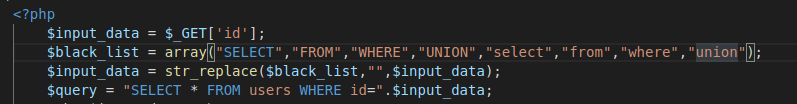
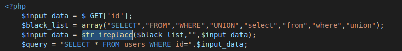

#REPORT
----------------------------------

##SQL Injection

1. **Nguyên nhân**:
 	- App sử dụng input của người dùng mà không thông qua việc làm sạch các kí tự liên quan với ngôn ngữ truy vẫn SQL như ***",',-,...***.
 	- Sử dụng phương pháp cộng chuỗi để ghép input người dùng vào câu lệnh SQL và truyền xuống database.
 	- Các input có thể là: username, password, search-keyword, cookies,...
2. **Phân loại:**
 	* In-band SQL Injection: Đây là loại cổ điển, phổ biến và dễ khai thác nhất, bởi vì output đều rõ ràng và chúng ta có thể nhận biết khá dễ dàng.
 	
		* Error-Based SQLi: Dựa trên các lỗi, exception được xuất ra màn hình khi có các hàm hoặc query chạy sai. Trong một số trường hợp, chỉ Error-Based không đủ để có thể liệt kê một số trường của database.
		* Union-Based SQLi: Loại tấn công dựa trên câu lệnh **UNION** với 2 mệnh đề **SELECT**, app sẽ xuất ra data mà atker cần dưới dạng plain-text. Các lệnh hỗ trợ đi kèm thường là ***limit, order by, offset,...***.
 	
 	* Inferential SQL Injection: Hay còn được biết với cái tên Blind SQL Injection. Đúng như cái tên, vì output không được xuất ra hoặc không rõ ràng nên phải dựa vào cách mà app phản ứng đối với các query lạ như *sleep(), benchmark(),...*
 		* Time-Based SQLi: Dựa vào thời gian delay của app để truy xuất thông tin thông qua các câu điều kiện như ***IF,...*** và các hàm ***sleep(), benchmark()***
 		* Boolean-Based SQLi: Dựa vào "giá trị" đúng/sai của câu query bằng toán tử ***&&*** và các hàm như ***ascii(), exists(),...***
 	* Một số loại khác: Second order SQL Injection (kết hợp cả 2 loại trên),...
 	* Out of band SQL Injection:

3. **Attker có thể làm được gì với SQL injection:**
 	* Tất nhiên điều gần như chắc chắn có thể làm là truy xuất thông tin của database, tất cả dữ liệu nằm trong database một cách không hợp lệ.
 	* Nguy cơ cao hơn là có thể bị thay đổi dữ liệu trong database nếu như developer phân quyền không cẩn thận. Attker có thể làm việc này thông qua các câu truy vấn như ***DROP TABLES, UPDATE, INSERT, DELETE, MODIFY,....***
 	* Ngoài ra, SQLi có thể dẫn đến RCE nhờ vào chức ra output INTO OUTFILE của SQL, điều này tạo cho attker khả năng ghi file(chỉ trong một số trường hợp) đặc biết là file đuôi **.php**.

4. ***Các truy vẫn thường dùng:***

	* ***UNION***: Ghép kết quả của 2 bảng và 2 bảng này phải trùng số cột, cú pháp: ***SELECT ... UNION SELECT ...***. Đây là truy vấn dùng rất nhiều trong khai thác SQL Injection, đặc biệt là In-band SQLi.
	* ***ODER BY, GROUP BY***,...: 2 truy vấn để tìm số cột của câu select trước, hỗ trợ khai thác bằng truy vấn ***UNION***.
	* ***CONCAT()***,...: Hàm có chắc năng cộng các chuỗi kết quả với nhau. Ví dụ câu *SELECT* đầu tiên có dạng như *SELECT username FROM user WHERE ...*, nếu không dùng concat(), thì mỗi truy vấn sẽ chỉ lấy được 1 trường của database. Nếu dùng concat thì sẽ tiết kiệm được nhiều thời gian. Ví dụ: *SELECT username FROM users WHERE id=1 union SELECT CONCAT(phonenumber,email,...) FROM users -- -*
	* ***LIMIT, OFFSET***: Sắp xếp hoặc giới hạn số hàng mà câu truy vấn có thể trả về, vì đôi khi app sẽ chỉ xuất ra màn hình kết quả đầu tiên trong bảng kết quả của chúng.
	* ***HEX(), ASCII(),...***
	* ***LOAD_FILE()***: Đọc nội dung các file chưa thông tin nhạy cảm của server, ex: ***/etc/passwd, /etc/shadow,...***. Ví dụ: ***SELECT LOAD_FILE('/etc/passwd')***.
	* ***INTO OUTFILE***: Ghi kết quả của câu select vào một file nào đó (nếu user hiện tại có quyền ghi). Đây là câu lệnh có thể dẫn tới ***RCE*** (Remote Control Excution). Ví dụ: ***... UNION SELECT "<?php system("$_GET['cmd']"); ?>" INTO OUTFILE /var/www/html/shell.php*** (Trong trường hợp root directory là */var/www/html/*).
	* ***LIKE, BINARY LIKE,...***: Toán tử search **substring**, trả về true nếu **substring** được tìm thấy. Ví dụ: ***SELECT * FROM users WHERE username like "1337%"***. Câu truy vấn trên sẽ trả về tất cả những hàng có ***username*** bắt đầu bằng **"1337"**. Đây là toán tử rất hữu dụng trong khai thác Blind SQL Injection, có thể dùng nó để chạy các giải thuật **Brute-force**.
	
5. **Bypass:**
Tuy đã có cơ chế để lọc một số input nhưng bên cạnh đó vẫn có cách để bypass chúng, dưới đây là một số cách:
	* URL Encoding:
		* ***?id=1%27+or+1=1+--+-***
	* Muti-Encoding:
		* ***?id=1%2527%2Bor%2B1=1%2B--***. Khi đó %2527 sẽ trở thành %27 = "
	* Blacklist:
		
		* ***?id=1 UniOn sElEct * FrOm users -- -***. Nguyên nhân là do code phân biệt chữ hoa và chữ thường.

		
		
		* Ở đây code đã replace mà không phân biệt hoa thường bằng hàm *str_ireplace()*, payload như sau: ?id=1 UNI**UNION**ON SE**SELECT**LECT * FR**FROM**OM users -- -
	
		* Dựa trên ***Parameter Pollution***:  Một số ứng dụng khi nhận nhiều hơn 1 các tham số trùng tên sẽ sử dụng tham số đâu tiền, một số sử dụng tham số sau cùng, một số lại xử lí tất các tham số đó, có thể thông qua điểm này để bypass blacklist.Ví dụ payload: 
		***?id=1+unio&id=n+selec&id=t+\*+fro&id=m+user+--+-***
		* Sử dụng inline comment của SQL, cú pháp /* comment */. Tùy thuộc vào version của database đang sử dụng mà kĩ thuật này có thành công hay không. Nếu system parse comment thành null byte hoặc kí tự rỗng thì có khả năng thành công. Ví dụ payload: 
			***?id=1+uni/\*\*/on+sele/\*\*/ct+\*+fr/\*\*/om+users+--+-***.
		* Buffer over flow: payload 
			***?id=1+/\* 'A'\*100000 \*/+union+select+\*+from+users+--+-***
		* Ngoài ra, các keyword như ***or*** hoặc ***and*** cũng sẽ bị filter, có thể bypass bằng các kí tự ***||*** và ***&&***.
	
	* SQL comment excution: Từ **MySQL** version *2.23.02* đã hỗ trợ chức năng chạy query trong comment, cú pháp như sau: /\*!32302 query \*/. Ví dụ: ***SELECT+\*+/\*!32302 FROM \*/ users+--+-*** hoặc  ***SELECT+/\*!32302 1/0 \*/+FROM+users+--+-***. Nếu thực hiện được, query trên sẽ trả về lỗi ***divison by 0 error***
	* Khác:

6. ***Ví dụ một số cuộc tấn công SQL Injection:***
 	* In-band SQL Injection:
 		* Union-based:
 		* Error-based:
 	* Inferential SQL Injection:
 		* Time-based:
 		* Boolean-based:
 	* Second Order SQL Injection
 	* Out of band SQL Injection:
7. **Khắc phục:**
	* PHP cung cấp một hàm rất hữu dụng để filter input người dùng khỏi SQL Injection là ***mysql_real_escape_string()***.
	* Hạn chế sử dụng phương pháp cộng chuỗi, đặc biệt là với input người dùng.